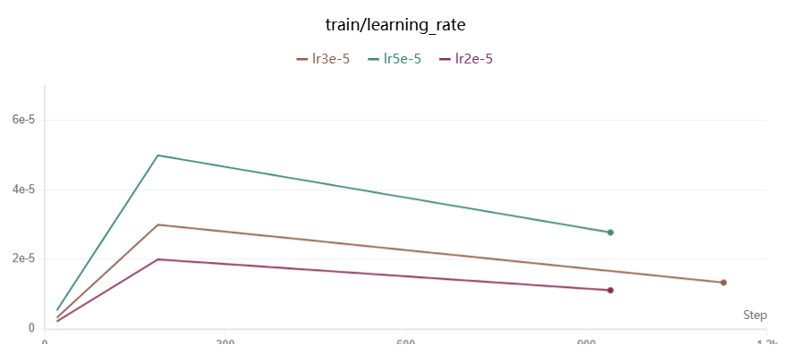
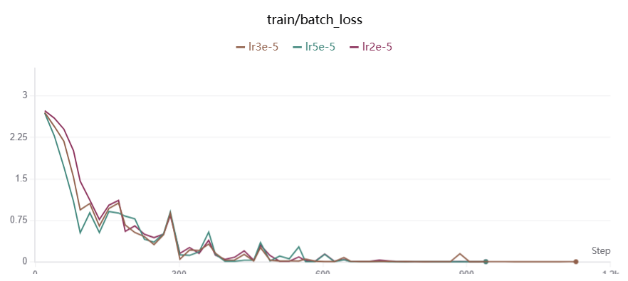
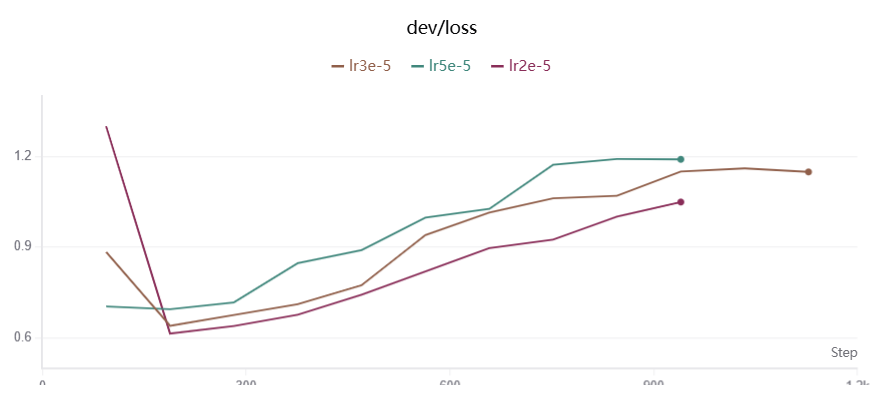
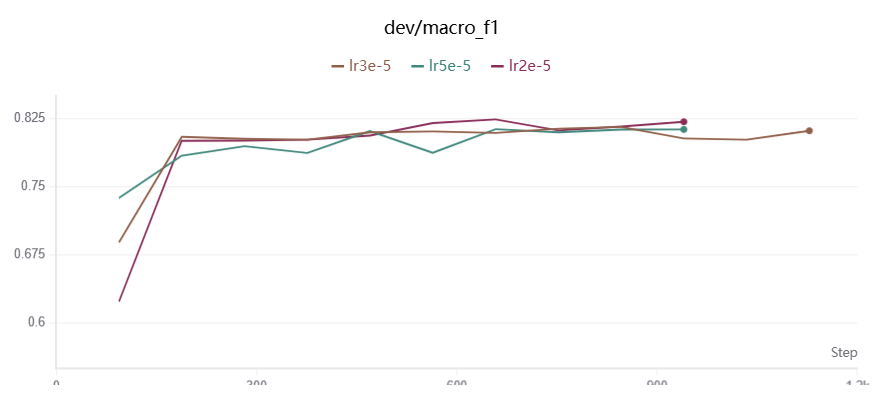

# 基于 BERT 的中文新闻文本分类

## 1. 任务介绍

本项目使用 `bert-base-chinese` 完成中文新闻标题的 **15 分类任务**。模型读取新闻标题，通过 BERT 获取上下文特征，取 **`[CLS]`** 位置的向量，经过 Dropout 和 Linear 分类层得到 **15 个类别的 logits**。

模型基本流程：

```text
新闻标题
-> BertTokenizer
-> BERT
-> [CLS] 特征
-> Dropout
-> Linear
-> 15 个类别的 logits
```

项目包含**数据读取、模型训练、验证集评价、最佳模型保存、断点恢复和 SwanLab 实验记录**。

## 2. 数据集介绍

原始数据每行使用 **`_!_`** 分隔，格式如下：

```text
news_id_!_label_code_!_label_name_!_title_!_keywords
```

程序使用 **`label_code`** 作为原始标签，使用 **`title`** 作为模型输入。读取数据时会跳过空行、字段不完整、标签非法或标题为空的样本。

| **数据集** | **文件**              | **样本数** | **用途** |
| ------- | ------------------- | ------- | ------ |
| 训练集     | `data/train_3k.txt` | 3000    | 训练模型   |
| 验证集     | `data/dev_1k.txt`   | 1000    | 选择最佳模型 |
| 测试集     | `data/test_1k.txt`  | 1064    | 评价最终模型 |

数据集包含以下 **15 个类别**：

```text
news_story、news_culture、news_entertainment、news_sports、
news_finance、news_house、news_car、news_edu、news_tech、
news_military、news_travel、news_world、stock、
news_agriculture、news_game
```

## 3. 项目组织结构

```text
textclassfication/
├── configs/
│   └── baseline.yaml        # 基准实验配置
├── arguments.py             # 解析 --config参数
├── config.py                # 加载、校验YAML配置
├── dataset.py               # 数据读取和 DataLoader
├── model.py                 # BERT 分类模型
├── metrics.py               # 手写评价指标
├── checkpoint.py            # 模型保存与恢复
├── trainer.py               # 训练、验证、早停和测试流程
├── train.py                 # 命令行训练入口
├── data/                    # 训练、验证和测试数据
├── bertmodel/               # 本地预训练模型
├── checkpoints/             # 模型检查点
├── swanlog/                 # SwanLab 日志
└── README.md
```

## 4. 指令格式与使用方式

当前实验使用的核心环境如下：
软件** | **版本** |
| --- | --- |
| Python | `3.10.21` |
| PyTorch | `2.8.0+cu128` |
| Transformers | `4.48.3` |
| SwanLab | `0.10.0` |
| PyYAML | `6.0.3`

将 **`bert-base-chinese`** 放到 `bertmodel/bert-base-chinese/`。数据、模型、输出目录和训练超参数统一在configs/baseline.yaml中配置，相对路径会以项目根目录为基准解析。

查看命令说明：
```bash
python train.py --help
```

检查数据读取：

```bash
python dataset.py --config configs/baseline.yaml
```

使用基准配置训练：

```bash
python train.py --config configs/baseline.yaml
```
进行新实验时，先复制基准配置，再修改新文件中的参数和实验名称：
```bash
cp configs/baseline.yaml configs/lr_2e-5.yaml
python train.py --config configs/lr_2e-5.yaml
```

配置文件主要分为以下几部分：

|配置段** | **内容** |
| --- | --- |
| `experiment` | 实验名称 |
| `data` | 数据目录以及训练集、验证集和测试集文件名 |
| `model` | 预训练模型路径、最大长度和 Dropout |
| `labels` | 原始标签编号与类别名称 |
| `training` | Epoch、Batch Size、学习率、随机种子等 |
| `early_stopping` | 早停等待轮数和最小提升值 |
| `output` | checkpoint 保存目录 |
| `swanlab` | SwanLab 开关和项目名称

从检查点继续训练时，保持 `experiment.name` 不变，并将配置中的
`training.resume_training` 改为 `true`：
```bash
python train.py --config configs/baseline.yaml
```
每次运行都会将实际传入的 YAML 保存为
`checkpoints/实验名称/config.yaml`。训练过程中始终更新
**`last_checkpoint.pt`**，并按照验证集 **Macro-F1** 保存
**`best_model.pt`**。训练结束后，程序加载最佳模型并在测试集上评价。

## 5. 实验分析

### 5.1 实验设置

| **编号** | **实验目的**    | **Learning rate** | **Batch size** | **分类头 Dropout** |
| ------ | ----------- | ----------------- | -------------- | --------------- |
| E01    | 基准实验        | `3e-5`            | 32             | 0.1             |
| E02    | 较小学习率       | `2e-5`            | 32             | 0.1             |
| E03    | 较大学习率       | `5e-5`            | 32             | 0.1             |
| E04    | 较小 Batch    | `3e-5`            | 16             | 0.1             |
| E05    | 较大 Batch    | `3e-5`            | 64             | 0.1             |
| E06    | 不使用 Dropout | `3e-5`            | 32             | 0.0             |
| E07    | 中等 Dropout  | `3e-5`            | 32             | 0.2             |
| E08    | 较大 Dropout  | `3e-5`            | 32             | 0.3             |

**模型选择只依据验证集 Macro-F1。测试集只用于评价选定的最佳检查点，不参与超参数选择。**

#### 基准实验

下面的结果表和学习率曲线使用`lr3e-5`为基准，并与 `lr2e-5`、`lr5e-5` 在相同 Batch Size、Dropout、随机种子和早停设置下进行比较。



### 5.2 学习率对比

| **Learning rate** | **运行名称** | **Best epoch** | **Stop epoch** | **Best Dev Macro-F1** | **Test Loss** | **Test Accuracy** | **Test Macro-F1** |
| ----------------- | -------- | -------------- | -------------- | --------------------- | ------------- | ----------------- | ----------------- |
| `2e-5`            | `lr2e-5` | 7              | 10             | **0.8244**            | **0.8897**    | 0.8298            | 0.8119            |
| `3e-5`            | `lr3e-5` | 9              | 12             | 0.8161                | 1.0428        | **0.8393**        | **0.8214**        |
| `5e-5`            | `lr5e-5` | 7              | 10             | 0.8136                | 1.1404        | 0.8223            | 0.8126            |

三组实验的 Batch Size 均为 32，因此每个 epoch 包含 94 个训练 step。Best epoch 根据 SwanLab 中 Dev Macro-F1 最大值所在 step 换算得到；Stop epoch 是实际触发早停的轮次。

| **训练 Batch Loss**      | **验证集 Loss**           |
| ---------------------- | ---------------------- |
|  |  |



三组训练损失都持续下降并最终接近 0，但收敛速度不同：`5e-5` 最快，`3e-5` 次之，`2e-5` 相对较慢。**较大的学习率可以更快拟合训练集，却没有得到更好的验证集结果。**

三组 Dev Loss 都在较早阶段达到最低点，随后随着训练继续而上升。`2e-5`、`3e-5`、`5e-5` 的最低 Dev Loss 分别为 0.6139、0.6396 和 0.6944；`5e-5` 后期上升最明显，说明它更容易快速过拟合。Dev Macro-F1 方面，`2e-5` 在第 7 轮取得最高值 **0.8244**，优于 `3e-5` 的 0.8161 和 `5e-5` 的 0.8136。

按照预先确定的“以最佳 Dev Macro-F1 选择超参数”原则，本次学习率实验应选择 `2e-5`。`3e-5` 的 Test Accuracy 和 Test Macro-F1 虽然最高，但**测试集只用于最终评价，不能据此反向选择学习率**。验证集排序与测试集排序不一致，也说明单次、单随机种子实验存在波动；三组差距应通过多个随机种子重复实验进一步确认。

### 5.3 Batch Size 对比

| **Batch size** | **每 epoch 步数** | **停止 epoch** | **Test Loss** | **Test Accuracy** | **Test Macro-F1** |
| -------------- | -------------- | ------------ | ------------- | ----------------- | ----------------- |
| 16             | 188            | 9            | 1.1488        | 0.8129            | 0.8014            |
| 32（参照）         | 94             | 12           | 1.0428        | **0.8393**        | **0.8214**        |
| 64             | 47             | 12           | 0.9479        | 0.8204            | 0.8064            |

**Batch 64 在较少的优化步数内较快进入平台期，最终测试指标低于参照组。Batch 16 每个 epoch 的更新次数最多，收敛所需步数更长，本次测试结果在三组中最低。**&#x42;atch 32 的 Test Accuracy 和 Test Macro-F1 均为三组最高，表现最均衡。

三组实验现在使用相同的 `3e-5` 学习率，但固定 epoch 时不同 Batch Size 会同时改变总优化步数和 warmup 步数。因此，这里比较的是三套完整训练方案，而不是严格固定更新次数的单因素实验。

### 5.4 分类头 Dropout 对比

这里的 Dropout 只作用于 `[CLS]` 特征与 Linear 分类层之间，不会改变 BERT 内部 Transformer 层原有的 Dropout。

| **分类头 Dropout** | **停止 epoch** | **Test Loss** | **Test Accuracy** | **Test Macro-F1** |
| --------------- | ------------ | ------------- | ----------------- | ----------------- |
| 0.0             | 8            | 0.7828        | 0.8280            | 0.8123            |
| 0.1（参照）         | 12           | 1.0428        | **0.8393**        | **0.8214**        |
| 0.2             | 8            | 0.8094        | 0.8317            | 0.8194            |
| 0.3             | 8            | 0.8504        | 0.8233            | 0.8092            |

四组结果整体接近，说明仅调整分类头 Dropout 对当前模型的影响有限。使用新基准后，**Dropout 0.1 的 Test Accuracy 和 Test Macro-F1 最高；Dropout 0.0 的测试损失最低；Dropout 0.3 没有继续提升指标，较强的正则化可能已经开始抑制分类头学习。**

**测试集结果不能直接用于选择 Dropout，最终设置仍应由各组的最佳 Dev Macro-F1 决定。**

### 5.5 结论

* 各组训练损失最终都接近 0，而验证损失在早期下降后持续回升，模型存在明显过拟合；**保留早停机制是必要的**。
* 按最佳 Dev Macro-F1，**2e-5 是当前三档学习率中的首选**；按描述性测试结果，`3e-5` 运行取得最高 **Test Accuracy 0.8393** 和 **Test Macro-F1 0.8214**。
* **Batch 32 和分类头 Dropout 0.1** 的描述性测试结果分别是各自对比组中最高的。
